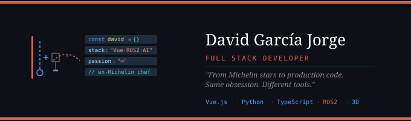

# David García Jorge

Full Stack Developer · Vue.js · Python · TypeScript · ROS2 · Three.js

I used to manage teams in Michelin-starred kitchens.
Now I build production software with AI, 3D data and robotics.
Same obsession. Different tools.

---

## What I build

- ML systems that classify wood for cooperage industry
- ROS2 robotics simulations for autonomous environments
- Multilingual platforms that generate AI-powered PDF reports

## Stack

Vue.js · Nuxt · Python · TypeScript · Three.js · ROS2 · Gazebo · Docker · PostgreSQL

## Currently

Studying official Web Application Development degree (DAW) while working full-time in production.
Certified AESA/EASA drone pilot — A1/A3 · A2 · STS.

## Find me

[LinkedIn](https://www.linkedin.com/in/davidgarciajorge)

### ✍️ Random Dev Quote

<!-- Proudly created with GPRM ( https://gprm.itsvg.in ) -->
